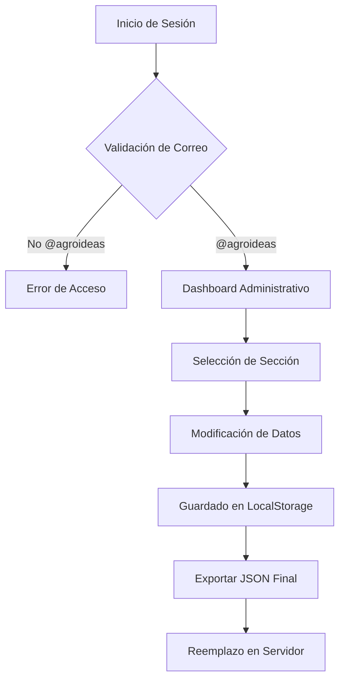

# Arquitectura de Datos e Interacción Dinámica

## 1. El Motor de Datos (JSON)
El portal utiliza un enfoque de **datos desacoplados**. Toda la información variable se almacena en el archivo `data/content.json`, permitiendo actualizaciones sin modificar la estructura HTML.

### Estructura del Content.json
El archivo se divide en tres ramas principales:
- `sections`: Contenido para las páginas de Ejes de Gestión (definición, finalidad, fases y roles).
- `documents`: Documentos informativos principales en formato de tarjetas interactivas.
- `repository`: Registros para las tablas y acordeones del Repositorio Institucional (Directivas de Unidades, Tablas de Innovación Pública y Publicaciones de la UPP).

## 2. Ciclo de Vida del Contenido (Renderizado)
El proceso de carga sigue este flujo:
1. **Fetch:** `js/content-loader.js` intenta obtener `data/content.json`.
2. **Fallback:** Si existe una versión más reciente en el `localStorage` (modificada en una versión administrativa local bajo el identificador `agro_content_data`), se prioriza esta sobre el archivo estático.
3. **Parsing:** El script identifica el ID de la página actual.
4. **Injection:** Se inyectan los textos, imágenes y enlaces en los contenedores designados.
5. **Post-Processing:** Se disparan las inicializaciones de DataTables y animaciones AOS tras la inyección.

## 3. Seguridad y Autenticación (Proyección - Fase Futura)

> [!NOTE]
> Esta sección describe el diseño de la lógica de acceso proyectada para el mantenimiento autónomo del portal en fases posteriores. Los archivos `js/auth.js` y `data/users.json` no están incluidos en el entregable estático inicial.

El acceso al panel administrativo estará protegido por una capa de seguridad frontend:
- **Dominio Institucional:** Solo se permitirán correos finalizados en `@agroideas.gob.pe`.
- **Persistencia de Sesión:** Utilizará `sessionStorage` para mantener al usuario activo durante la navegación del panel.
- **Roles:** Soportará roles de administrador y editor para restringir acciones (borrado vs edición de JSON).

## 4. Diagrama de Flujo (Lógica Admin - Proyección Futura)

## 5. Gestión del Repositorio (DataTables Interface)
La interacción con las tablas de documentos se gestiona mediante:
- **Filtros Dinámicos:** Búsqueda en tiempo real por categoría o palabra clave.
- **Estado de Carga:** Spinners de carga mientras se procesan los registros grandes.
- **Exportación:** Botones integrados para descarga en Excel, PDF e impresión directa.
